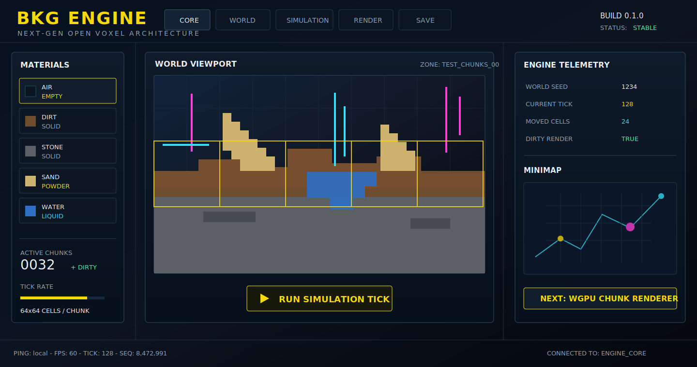
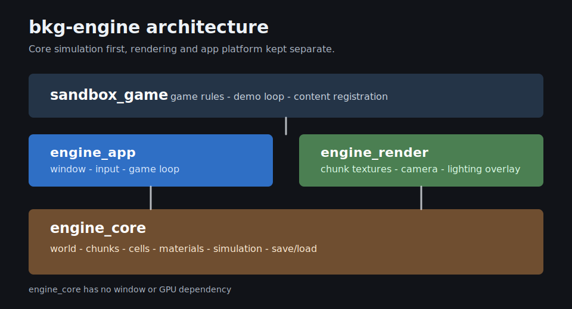

# 2D Voxel Engine Prototype



This repository contains the first implementation slice for a Rust 2D voxel/sandbox engine.

Implemented so far:

- chunked world storage with correct negative coordinate handling
- compact cell and material registry types
- deterministic flat world generation
- single-threaded sand and water simulation
- dirty chunk flags for render/save/light follow-up work
- binary save/load helpers
- a small CLI sandbox demo

The current goal is correctness and a clean engine core. Rendering, window/input handling, ECS, lighting, and mod loading are intentionally left as next milestones.

## Architecture



## Run

```powershell
cargo run -p sandbox_game
```

## Test

```powershell
cargo test
```
