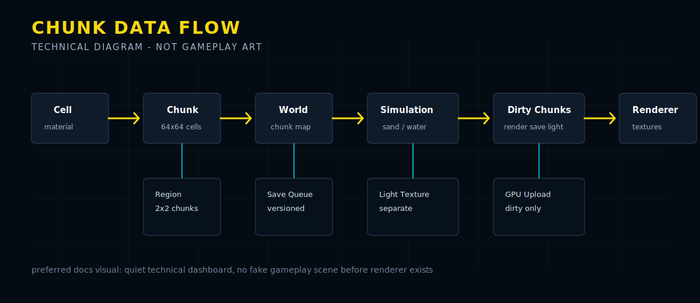

# 2D Voxel Engine Prototype

This repository contains the first implementation slice for a Rust 2D voxel/sandbox engine.

The project is an engine foundation, not a finished game. The documentation should present technical architecture, data flow, and implementation milestones rather than simulated gameplay screenshots.

## Architecture


## Data Flow



## NOVA 2.5 Vision


The full target architecture is documented in [docs/nova-2-5-master-architecture.md](docs/nova-2-5-master-architecture.md).

Implemented so far:

- chunked world storage with correct negative coordinate handling
- compact cell and material registry types
- deterministic flat world generation
- single-threaded sand and water simulation
- dirty chunk flags for render/save/light follow-up work
- binary save/load helpers
- a small CLI sandbox demo

The current goal is correctness and a clean engine core. Rendering, window/input handling, ECS, lighting, and mod loading are intentionally left as next milestones.

## Run

```powershell
cargo run -p sandbox_game
```

## Test

```powershell
cargo test
```
