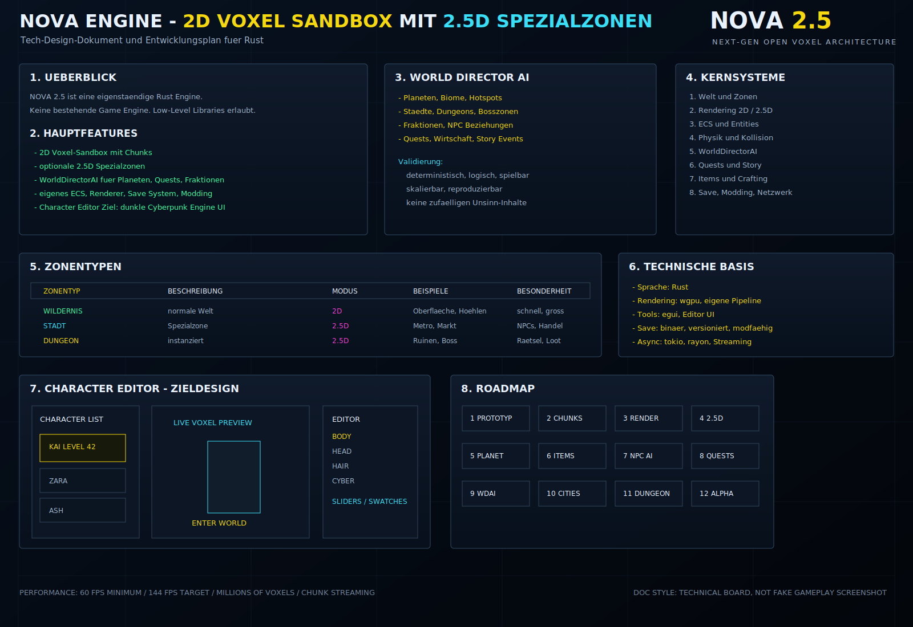
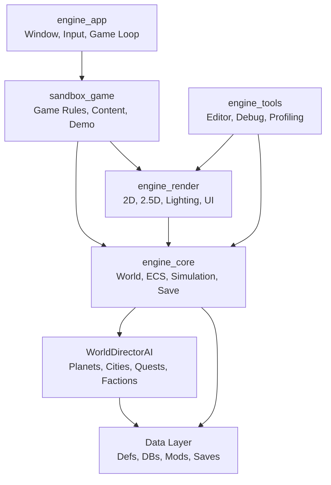
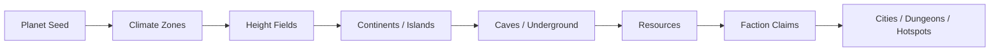
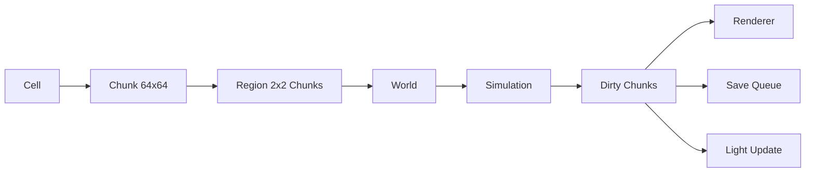

# NOVA 2.5 Master Architecture

**NOVA 2.5** steht fuer **Next Generation Open Voxel Architecture**.

Dieses Dokument beschreibt die Zielarchitektur einer eigenstaendigen Engine,
die vollstaendig von Null in Rust entwickelt wird. NOVA 2.5 ist kein Spiel und
verwendet keine bestehende Game Engine wie Unity, Unreal, Godot, Bevy Engine,
Flax oder vergleichbare Systeme.

Erlaubt sind Low-Level- und Infrastruktur-Libraries:

```text
wgpu     GPU API
rapier   Physik
egui     Tools und Editor UI
rodio    Audio
serde    Serialisierung
rayon    CPU Parallelisierung
tokio    Async IO und Streaming
lua      Scripting
```

Gameplay-, World-, ECS-, Rendering-, Streaming-, Quest-, Fraktions- und
KI-Architektur werden als eigene Engine-Systeme entwickelt.



## 1. Engine Vision

NOVA 2.5 ist eine modulare Sandbox-RPG-Engine fuer grosse 2D-Voxel-Welten mit
optionalen 2.5D-Spezialzonen.

Die Engine soll folgende Inhalte tragen:

- 2D-Voxel-Welten
- prozedurale Planeten
- dynamische Fraktionen
- NPC-Gesellschaften
- Housing
- Staedte
- Dungeons
- Bosszonen
- Quests
- KI-generierte Inhalte
- spezielle 2.5D-Zonen fuer inszenierte Orte

Die wichtigste Architekturregel:

```text
NOVA 2.5 erzeugt keine zufaelligen Inhalte ohne Struktur.
Jeder generierte Inhalt muss logisch, reproduzierbar, spielbar und skalierbar sein.
```

## 2. Weltkonzept

### 2.1 Standardwelt

Die Hauptwelt ist eine seitlich scrollende 2D-Voxel-Welt.

Beispiele:

- Oberflaeche
- Hoehlen
- Minen
- Ozeane
- Biome
- Wildnis
- Ressourcenfelder

Darstellung:

```text
tile-basierte Voxel
Chunk-System
Millionen von Bloecken
Chunk-Texturen fuer dynamische Zellen
Light-Texturen fuer Beleuchtung
```

### 2.2 2.5D-Spezialzonen

2.5D wird nur in Spezialzonen verwendet, nicht als Standardwelt.

Beispiele:

- Staedte
- Housing
- Dungeons
- Boss-Arenen
- Story-Hotspots
- Raumstationen
- Fraktionshauptquartiere

Darstellung:

```text
isometrische Projektion
Hoehenebenen
Gebaeudekomplexe
mehrere Stockwerke
begrenzte Instanzraeume
```

2.5D-Zonen sind bewusst kleiner, dichter und kontrollierter als die normale
2D-Welt. Sie dienen Inszenierung, Navigation, Dialogen, Bosskaempfen und
komplexen Innenraeumen.

### 2.3 Uebergangssystem

Portale, Tueren, Hoehleneingaenge, Aufzuege oder Trigger verbinden die 2D-Welt
mit 2.5D-Zonen.

Beim Wechsel bleiben erhalten:

- Charakterdaten
- Inventar
- aktive Quests
- Fraktionsstatus
- Weltzeit
- relevante Story-Flags

## 3. Systemuebersicht



## 4. Rust Workspace

```text
nova_2_5/
+-- Cargo.toml
+-- crates/
    +-- engine_core/
    +-- engine_world/
    +-- engine_ecs/
    +-- engine_render/
    +-- engine_app/
    +-- engine_ui/
    +-- engine_ai/
    +-- engine_save/
    +-- engine_modding/
    +-- engine_audio/
    +-- engine_net/
    +-- engine_tools/
    +-- sandbox_game/
+-- assets/
+-- content/
+-- mods/
+-- saves/
+-- docs/
```

Aktueller Repo-Stand kann kleiner sein. Diese Struktur ist die Zielstruktur.
Crates werden erst angelegt, wenn ein System konkret implementiert wird.

## 5. WorldDirectorAI

`WorldDirectorAI` ist das Herz der prozeduralen Inhaltserstellung.

Aufgaben:

- Planeten erzeugen
- Biome erzeugen
- Staedte platzieren
- Dungeons erzeugen
- Monster erschaffen
- Bossgegner generieren
- Fraktionen erstellen
- NPC-Beziehungen simulieren
- Quests erzeugen
- Wirtschaft simulieren
- Story-Ereignisse erzeugen

### 5.1 Determinismus

Jeder generierte Inhalt entsteht aus stabilen Seeds.

```rust
pub struct DirectorSeed {
    pub planet_seed: u64,
    pub region_seed: u64,
    pub content_seed: u64,
}
```

Gleicher Seed plus gleiche Version plus gleiche Datenbanken erzeugt denselben
Inhalt.

### 5.2 Validierung

WorldDirectorAI darf keinen unspielbaren Unsinn erzeugen. Jeder Output laeuft
durch Validierung:

```text
Generation
  -> Constraint Check
  -> Playability Check
  -> Economy Check
  -> Story Coherence Check
  -> Difficulty Check
  -> Commit to World State
```

Beispiele:

- Ein Dungeon muss Start, Ziel, kritischen Pfad und Belohnung haben.
- Eine Stadt braucht Zugang, Fraktionsbesitz, Wirtschaft und NPC-Rollen.
- Eine Quest braucht Ursache, Ziel, Belohnung und Abbruchbedingungen.
- Monster duerfen nicht ausserhalb ihrer Biome oder Levelbereiche spawnen.

### 5.3 Director Datenmodell

```rust
pub struct WorldDirectorAI {
    pub seed: DirectorSeed,
    pub planet_db: PlanetDatabase,
    pub biome_db: BiomeDatabase,
    pub faction_db: FactionDatabase,
    pub quest_db: QuestTemplateDatabase,
    pub dungeon_db: DungeonTemplateDatabase,
    pub economy_model: EconomyModel,
}
```

### 5.4 Inhaltliche Verknuepfung

```text
Monster <-> Biome <-> Bewohner
Items   <-> Regionen <-> Ressourcen
Quests  <-> Fraktionen <-> Orte
Dungeons <-> Lore <-> Belohnungen
Staedte <-> Handel <-> NPCs
```

## 6. Planetengenerierung

Ein Planet besteht aus:

- Planet Seed
- Kontinenten
- Inseln
- Hoehlensystemen
- Untergrund
- Ozeanen
- Klimazonen
- Ressourcen
- Fraktionen

Pipeline:



## 7. Staedte

Staedte werden nicht als dekorative Orte erzeugt, sondern als simulierte
Systeme.

Jede Stadt besitzt:

- Reputation
- Wohlstand
- Kriminalitaet
- Politik
- Handel
- Fraktionskontrolle
- Jobs
- NPC-Rollen

City Generation:

```text
Terrain Anchor
  -> Road Graph
  -> Districts
  -> Buildings
  -> Economy Nodes
  -> NPC Population
  -> Faction Control
  -> Quest Hooks
```

## 8. Dungeons

Dungeons besitzen:

- Layout
- Raeume
- Fallen
- Raetsel
- Gegner
- Bosse
- Belohnungen
- Lore
- Thema
- Schwierigkeitsgrad
- Seltenheit

Dungeon Validation:

```text
has entrance
has reachable objective
has critical path
has optional branches
has reward
difficulty curve is valid
theme matches region and lore
```

## 9. Housing System

Spieler koennen:

- Haeuser bauen
- Basen bauen
- Moebel platzieren
- Lager verwalten
- NPCs einziehen lassen

Housing ist modular:

```rust
pub struct HousingModule {
    pub id: StringId,
    pub footprint: GridSize,
    pub sockets: Vec<HousingSocket>,
    pub tags: TagSet,
}
```

NPCs pruefen Housing nicht nur optisch, sondern systemisch:

- Bett vorhanden
- Lager erreichbar
- Licht ausreichend
- Gefahrenlevel akzeptabel
- Fraktionsstatus erlaubt Einzug

## 10. Character System

Das Character-System unterstuetzt einen Editor im Stil einer dunklen, modernen
Cyberpunk-Engine-UI mit Neon-Akzenten und Voxel-Preview.

Unterstuetzte Kategorien:

- Koerper
- Groesse
- Gewicht
- Muskelmasse
- Proportionen
- Kopf
- Gesichtsform
- Augen
- Nase
- Mund
- Haare
- Frisuren
- Farben
- Cyberware
- Implantate
- Prothesen
- Augmentierungen
- Kleidung
- Jacken
- Hosen
- Schuhe
- Ruestungen
- Materialsystem
- Farbpaletten

### 10.1 Character Datenmodell

```rust
pub struct CharacterProfile {
    pub id: CharacterId,
    pub name: String,
    pub body: BodyConfig,
    pub head: HeadConfig,
    pub hair: HairConfig,
    pub cyberware: CyberwareConfig,
    pub clothing: ClothingLoadout,
    pub colors: CharacterPalette,
    pub stats: CharacterStats,
}
```

### 10.2 Character Editor UI

Zielbild:

```text
dunkles Interface
technische Panels
neon-gelbe Hauptaktionen
cyan/pink Statusakzente
Voxel-Charaktervorschau
Live Rendering
Presets
Randomizer
```

Layout:

```text
Top Bar
  NOVA 2.5 Branding, Tabs, Profil, Settings

Left Panel
  Character List, New Character, Manage Characters

Center View
  World/Zone Preview, Character Preview, Enter World Action

Right Panel
  Character Editor
  Tabs: Body, Head, Hair, Cyber, Clothing, Colors
  Sliders, Swatches, Toggles, Presets

Bottom Panels
  News Feed, Active Quests, Chat, Minimap
```

Widgets:

- icon tabs
- sliders fuer Koerperwerte
- Farb-Swatches
- Segment-Controls fuer Body-Type
- Randomize Button
- Save Character Button
- Pose Controls
- Live Voxel Preview

## 11. ECS Design

NOVA 2.5 entwickelt ein eigenes ECS.

Core Components:

```rust
pub struct Transform {
    pub position: Vec3,
    pub rotation: Quat,
    pub scale: Vec3,
}

pub struct PhysicsBody {
    pub velocity: Vec3,
    pub mass: f32,
    pub grounded: bool,
}

pub struct Inventory {
    pub slots: Vec<ItemStack>,
}

pub struct Health {
    pub current: i32,
    pub max: i32,
}

pub struct FactionMember {
    pub faction: FactionId,
    pub reputation: i32,
}

pub struct Equipment {
    pub slots: EquipmentSlots,
}
```

ECS-Ziel:

```text
cache-freundlich
deterministisch
serialisierbar
modfaehig
parallelisierbar
debuggbar
```

## 12. Rendering

Basis: `wgpu`.

Renderer-Systeme:

- 2D Renderer
- 2.5D Renderer
- Chunk Meshing
- Chunk-Texturen
- Light-Texturen
- Shadows
- Particle System
- Post Processing
- UI Composition

### 12.1 2D Renderer

```text
Visible Chunks
  -> Dirty Texture Upload
  -> Chunk Quad Batch
  -> Entity Sprites
  -> Particles
  -> Light Overlay
  -> UI
```

### 12.2 2.5D Renderer

```text
Zone Instance
  -> Isometric Camera
  -> Height Layers
  -> Building Tiles
  -> Character Preview
  -> Local Lights
  -> UI Overlay
```

## 13. Save System

Speichern:

- Charaktere
- Welten
- Chunks
- Regionen
- Fraktionen
- Quests
- Housing
- NPC-Daten
- Director-State

Format:

```text
binaer
versioniert
chunk-/region-basiert
modfaehig
komprimierbar
```

Save Pipeline:


## 14. Modding

Modding wird datengetrieben gestartet.

Unterstuetzung:

- Lua
- JSON
- Script APIs
- Plugins
- Datenbanken fuer Items, Biome, NPCs, Quests

Modding-Regeln:

```text
Mods registrieren Daten ueber stabile String IDs.
Savegames speichern aktive Mods und Versionen.
Scripts duerfen Engine-State nur ueber sichere APIs veraendern.
Native Plugins sind optional und spaeter.
```

## 15. Netzwerk Architektur

Netzwerk ist optional, aber die Architektur soll vorbereitet sein.

Moegliche Modi:

- Singleplayer
- LAN Co-op
- Dedicated Server
- Instanzbasierte 2.5D-Zonen

Grundsatz:

```text
Server besitzt autoritativen World-State.
Clients senden Input und erhalten Replication Deltas.
```

## 16. Performance Ziele

Ziele:

- 60 FPS Minimum
- 144 FPS Ziel
- Millionen Voxel
- Chunk Streaming
- Multithreading
- Async Loading

Technische Massnahmen:

- aktive Chunks statt komplette Welt simulieren
- Dirty-Flags fuer Render, Save und Light
- getrennte Worker fuer Generation, Save/Load und Render-Buffer
- spaete Parallelisierung der Zell-Simulation
- Profiling vor Mikrooptimierung

## 17. Datenfluss



## 18. Entwicklungs-Roadmap

1. Prototyp: Window, Input, Basic Render, Voxel Grid.
2. Chunk System: 2D Chunks, Streaming, Save/Load Test.
3. 2D Rendering: Tiles, Lighting, Biome Basic World.
4. 2.5D System: Isometric Render, Zone Instancing.
5. Prozedurale Welt: Planeten, Biome, Hotspot-System.
6. Items und Loot: Datenbanken, Inventar, Crafting.
7. Monster und NPCs: AI Basic, Spawner, Combat Basic.
8. Spieler und Kampf: Bewegung, Waffen, Skills.
9. Quest System: Templates, Ziele, Belohnungen.
10. Save/Load: Welt, Player, Zonen, Fraktionen.
11. WorldDirectorAI: Inhalt generieren, Regeln, Validierung.
12. Staedte und NPCs: Stadtgraph, Haendler, Tagesablaeufe.
13. Dungeons: Layout, Gegner, Bosszonen.
14. Housing: Bauen, Einrichten, NPC-Einzug.
15. Fraktionen: Beziehung, Diplomatie, Kriege.
16. Story und Lore: Orte, Buecher, Events.
17. Modding: Scripts, Mods, APIs.
18. Editor: Welt, Items, Quests, NPCs, Debugging.
19. Balancing: Schwierigkeit, Loot, Progression.
20. Alpha: Komplette Engine-Scheibe.

## 19. Risiken und Loesungen

| Risiko | Loesung |
|---|---|
| Zu grosse Vision | Milestones strikt als Engine-Slices bauen |
| WorldDirectorAI erzeugt Unsinn | Constraint-, Playability- und Coherence-Checks |
| 2.5D blaeht Scope auf | Nur Spezialzonen, keine globale 2.5D-Welt |
| ECS wird zu komplex | Erst konkrete Query-Patterns, dann Abstraktion |
| Renderer koppelt an Simulation | Render Extraction als getrennte Phase |
| Savegames brechen bei Mods | Versionierte Schemas und stabile String IDs |
| Performance sinkt bei Millionen Voxel | Chunk-Aktivierung, Dirty Flags, Streaming, Profiling |

## 20. Zusammenfassung

NOVA 2.5 ist eine eigenstaendige Rust-Engine fuer 2D-Voxel-Sandbox-Welten mit
kontrollierten 2.5D-Spezialzonen. Die Architektur priorisiert saubere
Systemtrennung, deterministische Generierung, skalierbare Chunks, technische
Visuals, eigene ECS-/Renderer-/AI-Systeme und eine langfristig modfaehige
Datenbasis.

